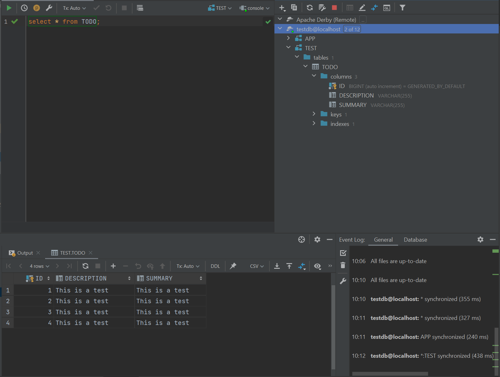
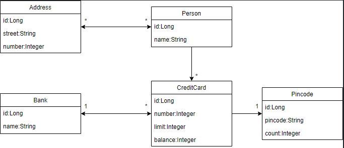
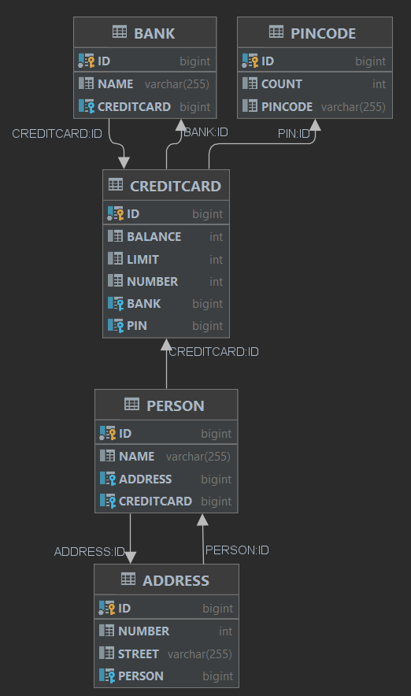

# DAT250: Experience Assignment 2

## Tasks  
Report the following:
*   technical problems that you encountered during installation and use of Java Persistence Architecture (JPA) and how you resolved
*  a link to your code for experiments 1 and 2 above
*   an explanation of how you inspected the database tables and what tables were created. For the latter, you may provide screenshots.
*  any pending issues with this assignment that you did not manage to solve

## Installing the Derby Database
I didnt want to install and configure the Apache Derby Database on my machine so I decided to use a [Docker Image of the Derby Database](https://github.com/az82/docker-derby) instead.
```
docker pull az82/docker-derby
docker run -d -p 1527:1527 --name apache-derby az82/docker-derby
```

## Experiment 1: Application using JPA  

I initially tried doing this in Visual Studio Code. However, This IDE had no way of inspecting the database tables being created. I heard from one of my group members that Intellij had this feature so I moved to Intellij for the remainder of this assignment.

In `persistence.xml` I made two changes. I set the path to the exposed port specified in the docker image, and I changed the driver to ClientDriver (remote connection).

```xml
<property name="javax.persistence.jdbc.driver" value="org.apache.derby.jdbc.ClientDriver"/>  
  <!-- TODO Change the path in the value of the property "javax.persistence.jdbc.url" here! -->  
<property name="javax.persistence.jdbc.url"  
  value="jdbc:derby://localhost:1527/testdb;create=true"/>
```

I also added the dependency for remote connection in `pom.xml`

```xml
<dependency>  
 <groupId>org.apache.derby</groupId>  
 <artifactId>derbyclient</artifactId>  
 <version>10.15.2.0</version>  
</dependency>
```
When running `Main.java` for the first time in Intellij I got some error messages which told me that the project files were compiled using an unsupported jdk. This was because I tried to run the project using Java 16 and not Java 11. After changing to Java 11 this was the result:

```java
[EL Info]: 2021-09-10 10:10:40.237--ServerSession(510147134)--EclipseLink, version: Eclipse Persistence Services - 2.7.7.v20200504-69f2c2b80d
Todo [summary=This is a test, description=This is a test]
Todo [summary=This is a test, description=This is a test]
Todo [summary=This is a test, description=This is a test]
Size: 3

Process finished with exit code 0
``` 

I inspected the database using the built-in Database Console.


## Experiment 2: Banking/Credit Card example JPA


When i viewed the database using the visualizer tool the database looks similar to the domain model in the assigment.


code can be found [here](https://github.com/OscarSommervold/DAT250-code/tree/main/dat250-jpa-example/eclipselink/jpa-basic/src/main/java/no/hvl/dat250/jpa/banking)
