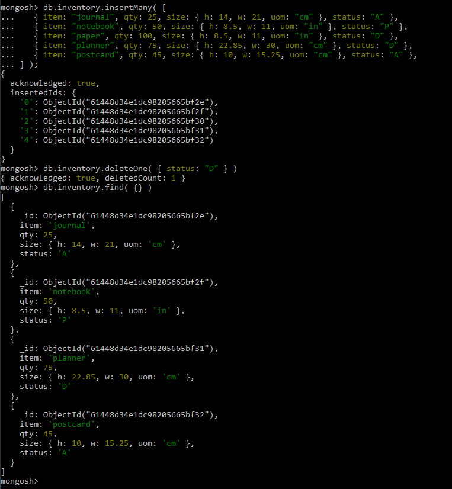

# DAT250: Experience Assignment 3

## Tasks
Report the following
-   Technical problems that you encountered during installation and use of MongoDB and how you resolved
-   Screenshots for:
    -   The correct validation of the installation package (https://docs.mongodb.com/manual/tutorial/verify-mongodb-packages/)
    -   Relevant results obtained during Experiment 1 (it is not necessary to put a single screenshot on each substep, but at least one significant from each CRUD operation).
    -   Experiment 2 example working and the additional Map-reduce operation (and its result) developed by each of you.
-   Reason about why your implemented Map-reduce operation in Experiment 2 is useful and interpret the collection obtained.
-   Any pending issues with this assignment which you did not manage to solve

## Installation: MongoDB Database
Followed the steps and tips outlined in the assignment and the installation guide.  
Validation of the installation package:  

## Experiment 1: MongoDB CRUD Operations

https://docs.mongodb.com/manual/tutorial/insert-documents/

https://docs.mongodb.com/manual/tutorial/query-documents/

https://docs.mongodb.com/manual/tutorial/update-documents/

https://docs.mongodb.com/manual/tutorial/remove-documents/

https://docs.mongodb.com/manual/core/bulk-write-operations/

## Experiment 2: Aggregation

### Map-Reduce tutorial
https://docs.mongodb.com/v4.4/tutorial/map-reduce-examples/
Followed the tutorial without issues, here is a screenshot of the map-reduce operation I created

