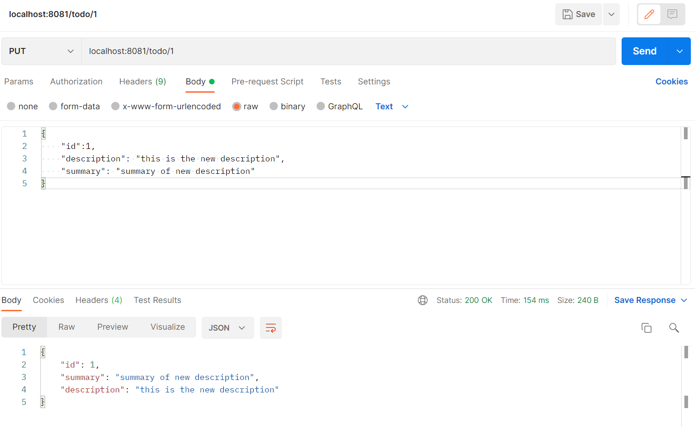
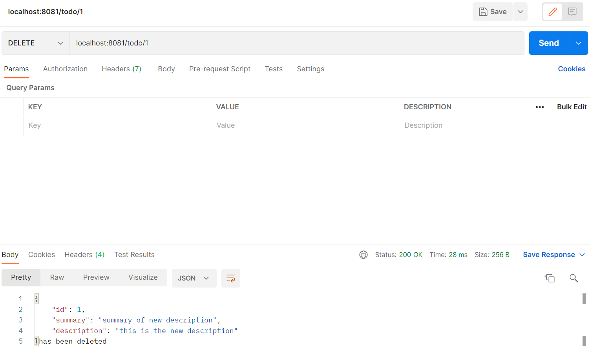

# DAT250: Experiment Assignment 4

## Tasks
Report the following
* technical problems that you encountered during installation and use of Java Persistence Architecture (JPA) and how you resolved
* a link to your code for experiment 2-4 above
* any pending issues with this assignment which you did not manage to solve

## Experiment 1: Spark /Java Framework project and Postman
Cloned the example from the lectures, created a Postman account, and downloaded the Desktop Agent.

put:

get:

## Experiment 2: REST API for TODO-items
Only issues I had was making sure my pom.xml and persistence.xml files were configured properly. I solved this by looking at my code for assignment 2.

Create:

Read:

Update:

Delete:

