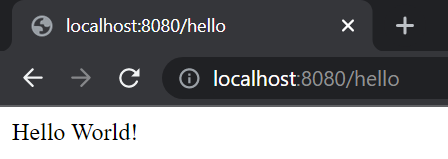
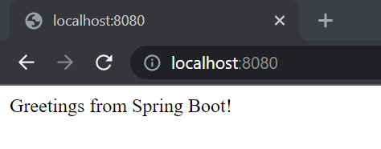
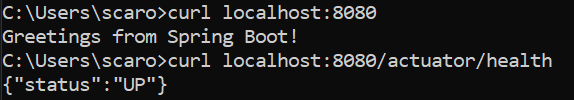
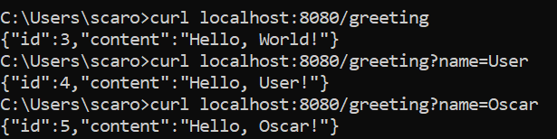
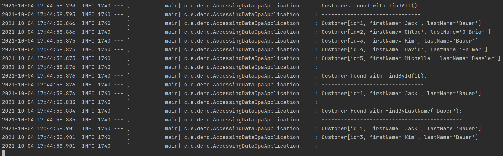

# DAT250: Experiment Assignment 5

##Tasks
Report the following
* technical problems that you encountered during the completion of the tutorial
* a link to your code for experiment 1-4 above
* any pending issues with this assignment which you did not manage to solve

## Experiment 1: Getting Started
Completed the tutorial without issues  

## Experiment 2: Spring Boot
Using browser  

Using terminal  

## Experiment 3: REST Service

## Experiment 4: Data Access

