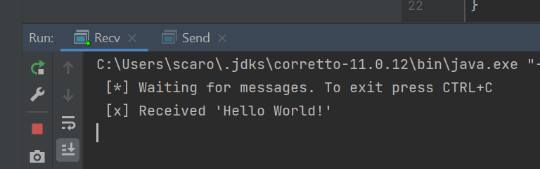
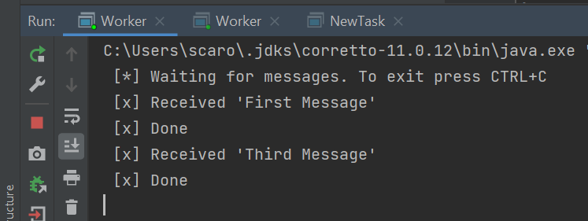
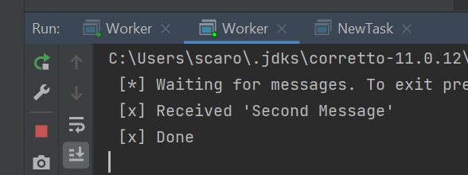
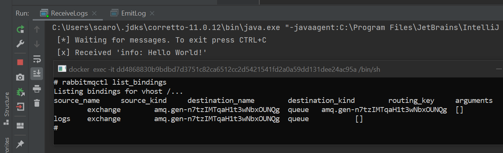

# DAT250: Experiment Assignment 7

## Tasks
Report the following
* technical problems that you encountered during the completion of the tutorial
* a link to your code for experiment 1-4 above
* any pending issues with this assignment which you did not manage to solve

## Experiment 1: Installation  
Installed using docker.  
``docker run -it --rm --name rabbitmq -p 5672:5672 -p 15672:15672 rabbitmq:3.9-management
``  

## Experiment 2: Hello World
Initially I tried to follow the tutorial using Spring. However, it did not compile due to some memory error. Upon inspection, I noticed that my RAM usage was at ~90%, so my guess is that 8GB of RAM is not enough in this case. 
I ended up following the tutorial using just Java.  

## Experiment 3: Queue Messaging
In Intellij I edited the configurations in Worker.java to allow "run in parallel". Then I opened two workers and ran NewTask three times.  
  

## Experiment 4: Topics  
